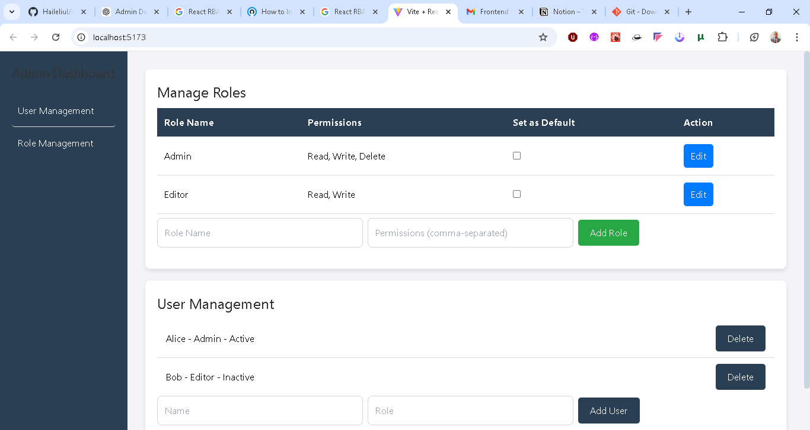
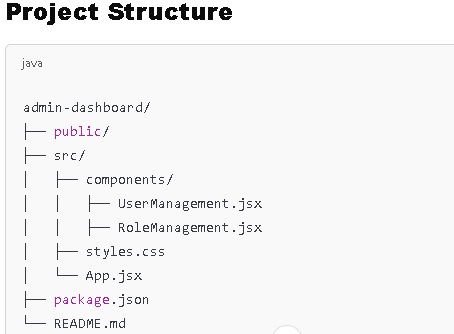

# Admin Dashboard for User, Role, and Permission Management

This project is a **React-based Admin Dashboard** designed to manage users, roles, and permissions efficiently. It provides an intuitive and user-friendly interface for administrators to control user access through role-based permissions.

---

## **Screenshoots**



## **Structuer**



## **Features**

### **User Management**

- View a list of users.
- Add, edit, or delete users.
- Assign roles to users.
- Toggle user status (Active/Inactive).

### **Role Management**

- Create, edit, and delete roles.
- Assign permissions (Read, Write, Delete) to roles.
- Set roles as default.

### **Dynamic Permission Handling**

- Easily modify role permissions.
- Permissions displayed clearly for quick comprehension.

### **Responsive Design**

- Built using **Tailwind CSS** for a modern, responsive, and clean user interface.
- Optimized for desktop and mobile views.

---

## **Tech Stack**

- **React**: Frontend framework for building interactive UIs.
- **Tailwind CSS**: Utility-first CSS framework for styling.
- **JavaScript (ES6+)**: Core language for handling logic.
- **Mock API (Optional)**: Simulates CRUD operations for user and role data.

---

## **Setup Instructions**

### **Prerequisites**

- Node.js and npm/yarn installed on your machine.

### **Installation**

1. **Clone the Repository**
   ```bash
   git clone https://github.com/Haileliul/-RBAC-User-Interface.git
   cd -RBAC-User-Interface
   ```
2. **Install Dependencies**
   ```bash
   npm install
   # or
   yarn install
   ```
3. **Run the Development Server**
   ```bash
   npm start
   # or
   yarn start
   ```
